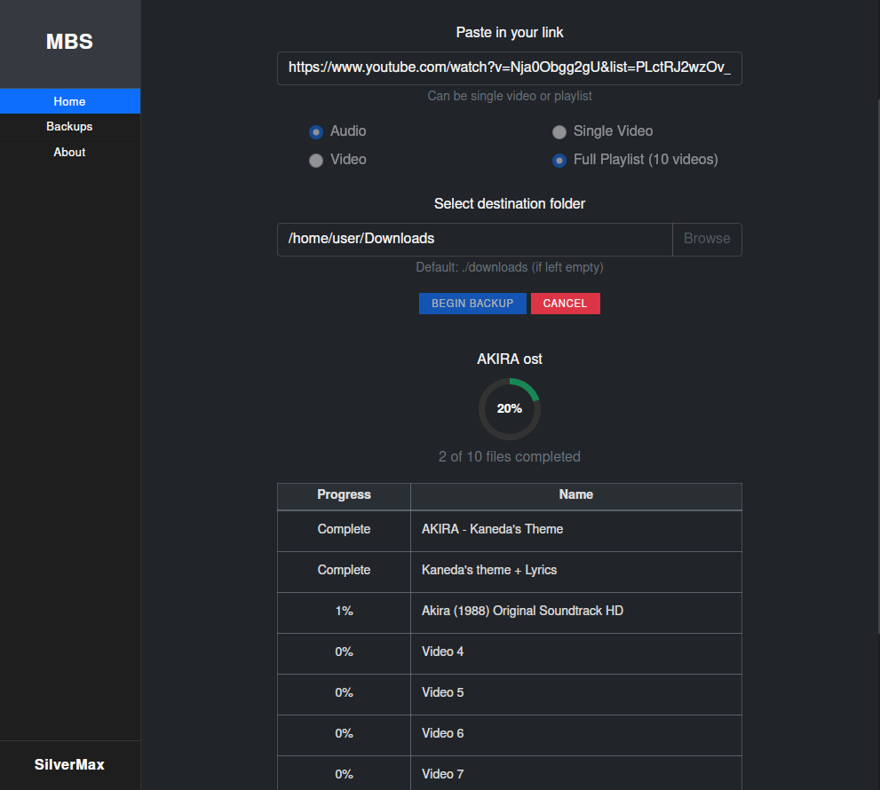

# Linux Media Downloader

**Linux Media Downloader** is a graphical application designed to help users easily download media content for personal, educational, or non-commercial use.

---

## 🚧 Project Status

- **In Development:** The app is functional but still evolving. Expect frequent updates and new features.
- **Current Support:** Only YouTube downloads are supported at this time, powered by the [yt-dlp](https://github.com/yt-dlp/yt-dlp) library.
- **Planned:** Support for additional media sources (e.g., Vimeo, SoundCloud, etc.) will be added in future releases.

---

## 🎯 Purpose

- Provide a simple, user-friendly interface for downloading media from online sources.
- Allow users to back up or archive their favorite videos and playlists for offline, personal use.
- Ensure compliance with non-commercial use only (see [LICENSE](LICENSE)).

---

## ✨ Features

- **YouTube Video & Playlist Download:**  
  Download individual videos or entire playlists from YouTube.
- **Audio or Video Mode:**  
  Choose to download either the audio (MP3/M4A) or the full video (MP4/WebM).
- **Progress Tracking:**  
  Real-time status updates and progress bars for downloads.
- **Download History:**  
  View a list of your previous downloads.
- **Folder Selection:**  
  Choose your preferred download directory.
- **Cancel Downloads:**  
  Stop an active download at any time.
- **Open Download Folder:**  
  Quickly open the folder containing your downloaded files.
- **Modern UI:**  
  Clean, responsive interface built with Flask and PyWebView.

---

## 🖼️ Screenshot

---

## 🖱️ Application Buttons & UI Elements

- **URL Input:**  
  Enter the YouTube video or playlist URL.
- **Download Type Selector:**  
  Choose between "Audio" or "Video" download.
- **Playlist Mode:**  
  Select "Single" (just the video) or "Playlist" (all videos in the playlist).
- **Download Button:**  
  Starts the download process.
- **Cancel Button:**  
  Cancels the current download.
- **Open Folder Button:**  
  Opens the download directory in your file manager.
- **History Tab:**  
  View your download history.
- **Backups Tab:**  
  (Planned) Manage and restore media backups.
- **About/Information:**  
  Learn more about the app and its usage.

---

## ⚙️ Requirements

- Python 3.8+
- [yt-dlp](https://github.com/yt-dlp/yt-dlp)
- Flask
- pywebview

(See `requirements.txt` for a full list.)

---

## 🖥️ AppImage Packaging (Linux)

You can package this application as an AppImage for easy distribution on Debian, Ubuntu, Mint, and other Linux systems. 

**Recommended storage location:**
- Store your AppImage in `~/Applications` (create this folder if it doesn't exist). This keeps user-level apps organized and accessible.

> **Note:** This project is a work in progress. AppImage packaging scripts and instructions will be provided as the project matures.

---

## 🚫 License

This software is free for personal, educational, or non-commercial use only.  
**Commercial use is strictly prohibited without prior written permission.**  
See [LICENSE](LICENSE) for details.

---

## 🛣️ Roadmap

- [ ] Add support for more media sources (Vimeo, SoundCloud, etc.)
- [ ] Enhanced backup and restore features
- [ ] Improved error handling and reporting
- [ ] User authentication (optional)
- [ ] More customization options

---

## 🤝 Contributing

Contributions are welcome! Please open an issue or pull request to discuss your ideas.

---

## 📢 Disclaimer

This project is not affiliated with YouTube or any other media provider.  
Please respect the terms of service of all platforms you use with this tool. 